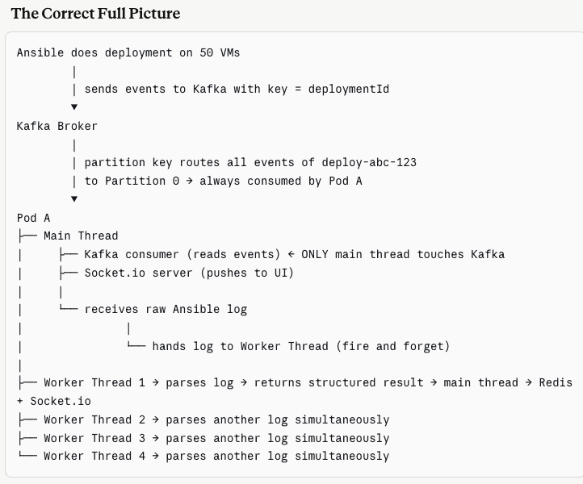

1. worker_threads      → Kafka log parsing on single pod
2. Partition key       → deploymentId ensures all events for one deployment
                         go to same pod
3. Pod restart         → Redis as external state store (not pod memory)
4. Socket.io           → live push to UI, Redis snapshot on reconnect
5. fork()              → Ansible executor (child_process)
6. cluster.fork()      → Deploy Tool Central API scaling

### Fork vs Cluster vs Worker Threads — How They Relate
child_process.fork()  = spawn a NEW Node.js process (separate V8 + memory) <br/>
cluster.fork()        = same thing BUT designed for HTTP servers (master/worker model) <br/>
worker_threads        = NEW thread INSIDE same process (shared memory) <br/><br/>

worker_threads  → same house, different rooms<br/>
fork()          → different house, can talk via phone (IPC)<br/>
cluster.fork()  → franchise model — same restaurant, multiple locations<br/><br/>

### Terminology
Kafka partition, consumer group 
Kafka topic partition -> assigned to consumer pods (nodejs service)

### How Kafka Partitioning Works in Your Case
{
  deploymentId: "deploy-abc-123",   ← THIS becomes the partition key <br/>
  vmName: "VM-23", <br/>
  region: "us-east", <br/>
  event: "TASK_COMPLETED", <br/>
  log: "..." <br/>
}



```Kafka doesn't know about pods directly. It works through two guarantees — same partition key always hashes to the same partition, and Kafka's group coordinator ensures each partition is owned by exactly one consumer in the group. Since each pod is one consumer, same partition key means same pod. The only time this changes is during a rebalance after a pod restart, at which point another pod inherits the partition and resumes from the last committed offset.```

### Kafka 
Kafka does not assign “servers to pods.”

Kafka assigns partitions to consumers (pods), not servers.

Think of it like this:

20 servers produce events
   ↓
Events go into Kafka topic partitions
   ↓
Partitions are assigned to consumer pods

Example:

Suppose topic has 6 partitions.

Partition 0 -> Pod A
Partition 1 -> Pod B
Partition 2 -> Pod C
Partition 3 -> Pod D
Partition 4 -> Pod E
Partition 5 -> Pod F

If you have 10 pods but only 6 partitions:

6 pods get work
4 pods sit idle


Producer
 ↓
Kafka Topic
 ↓
Topic has Partitions
 ↓
Consumer Group
 ↓
Partitions assigned to Consumers (running inside pods)


### Kafka architecture 
                PRODUCERS
   ------------------------------------
   Ansible        GitHub Actions    ArgoCD
      |               |              |
      +---------------+--------------+
                      |
                Produce Events
                      |
                      v

              +------------------+
              |   Kafka Topic     |
              | deployment-events |
              +------------------+

        -------------------------------------
        |                |                 |
        v                v                 v

   +-----------+    +-----------+    +-----------+
   |Partition 0|    |Partition 1|    |Partition 2|
   +-----------+    +-----------+    +-----------+

           (messages stored inside partitions)

                      |
                      v

         +--------------------------------+
         | Kafka Group Coordinator        |
         | ("Group Manager")              |
         | - Assigns partitions           |
         | - Detects failed consumers     |
         | - Handles rebalances           |
         +--------------------------------+

                      |
            Assign partitions to consumers
                      |

      ------------------------------------------------
      |                     |                       |
      v                     v                       v

+---------------+   +---------------+   +---------------+
| Consumer A    |   | Consumer B    |   | Consumer C    |
| (Hydra Pod 1) |   | (Hydra Pod 2) |   | (Hydra Pod 3) |
+---------------+   +---------------+   +---------------+

       P0                 P1                 P2

                      |
                      v

             Node.js processing
         (Kafka consumer + Socket.IO)

                      |
                      v

                 Deploy Tool UI
          (Live deployment logs/status)


### If that instance crashes before committing the offset, Kafka triggers a rebalance — another instance takes over that partition and re-reads from the last committed offset. This means the message gets reprocessed.
